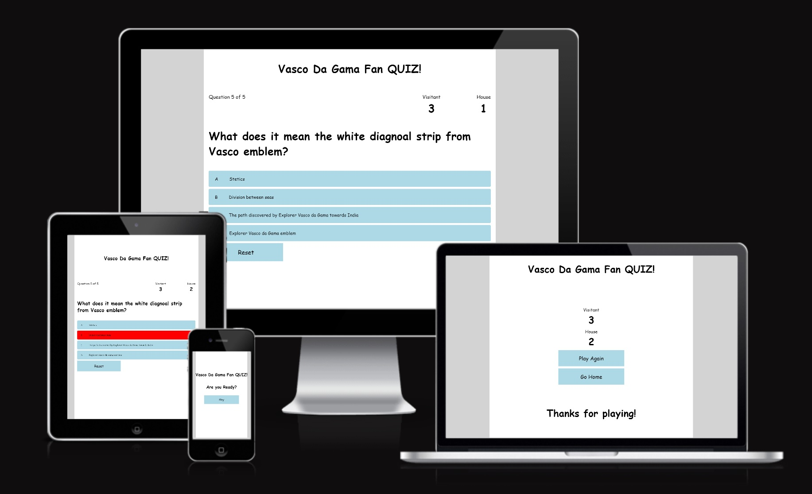

# Vasco Da Gama Fan QUIZ!

Vasco Da Gama Fan Quiz was made for the Second Project required to complete the Diploma in Full Stack Software Development program at The Code Institute and shoes to accomplish with success all requirements as well to provide the developer a great learning experience through out the process. 

This Quiz intends to target Vasco da Gama fans from all around the world where fans are able to get their knowlodge and curiosities about the team checked trough a series of Questions. Each correct answer will count a score point for you, and for each incorrect answer a point goes to the Outside Team.

## Features 

### Existing Features

- __Header__

  - Featured on all pages, the header will display our game name "Vasco Da Gama Fan QUIZ!".
  - Header will provide clear understanding of what game are they playing.

- __The Game Intro__

  - Question made to player if ready to start the game leading to options bellow.
  - Start button that will direct player to game page.

- __The Game__

  - Game is featured with progress of questions, so player can recognize current question and how many in total.
  - A score board simple and friendly displaying player score and in the event get a question wrong a point is given to the other team. 
  - Random question large and visible above choices available.
  - Choices from A to D and upon selection background color will change to green if correct option selected or red if incorrect.
  - Option to reset game before end page(end result).

- __The Game Ends__

  - The game ends and Player have the options to go back to main page or to go straight into another game. Custom scoreboard present at all times, we also thank player for playing this special game.

- __Features Left to Implement__

  - I would like to add a ranking feature based on names, so players can get a bit competitive and share with there friends on social media, increasing website visibility.
  - I would like to add sound to correct questions as similar to scoring a goal.

## Testing 

- Different browsers(Chrome, Safari and Firefox) been tested to verify that page would work with no issue as well as mobile and table devices are responsive to Media querie styles implemented.

- The project is responsive, have a good, simple and clean visual effect and is fully functional with correct results.

- All features within each individual page have been tested to confirm working properly and texts are clear and readable as well easy to understand.

- Correct or incorrect answers will be displayed as well tracking question or score functions.

- Any buttons present are functional, "Play", "Reset", "Play Again" and "Go Home".

## Issues and Bugs

- Corrections made to game.html and style.css paths.
- Some texts not in english fixed.
- Correction of function after JS validator.
- Scoreboard for end page created.
- Review CSS for visual improvement and different devices.
- Review of readme file.

## Validator Testing 

- HTML
  - No errors were returned when passing through the official [W3C validator](https://validator.w3.org/)
- CSS
  - No errors were found when passing through the official [(Jigsaw) validator](https://jigsaw.w3.org/css-validator/)
- JSHint
  - Test made with Js presented no issues  [(Jigsaw) validator](https://jshint.com/)
- Accessibility
  - Accessibility confirmed by running it through lighthouse in devtools

    

    

## Unfixed Bugs

No unfixed bugs

## Technologies Used
### Main language used

- [HTML5](https://en.wikipedia.org/wiki/HTML5 "Link to HTML Wiki")
- [CSS3](https://en.wikipedia.org/wiki/Cascading_Style_Sheets "Link to CSS Wiki")
- [JS](https://en.wikipedia.org/wiki/JavaScript "Link to JS Wiki")

### Frameworks, Libraries & Programs Used

- [GitPod](https://gitpod.io/ "Link to GitPod homepage")
     - GitPod was used for writing code, commiting, and then pushing to GitHub.
- [GitHub](https://github.com/ "Link to GitHub")
     - GitHub was used to store the project after pushing.
- [Figma](https://www.figma.com/ "Link to Figma homepage")
     - Figma was used to create the concept art during the design phase of the project.

## Deployment

- This project was developed using [GitPod](https://www.gitpod.io/ "Link to GitPod site"). 
- Through Gitpod terminal I have executed commitments and pushed changes to [GitHub](https://github.com/ "Link to GitHub").
- The site was deployed to GitHub pages. The steps to deploy are as follows: 
  - In the GitHub repository, navigate to the Settings tab 
  - From the source section General, select the option "Pages".
  - Under GitHub Pages, select Branch from "None" to "main".
  - Once selected "main" push the save option, the page will be automatically refreshed with a detailed ribbon display to indicate the successful deployment. 

The live link can be found here - https://6viper.github.io/Vasco-Quiz-P2/

- Details on how to contribute for this project can be found on link bellow, "Forking a project and cloning a fork".
  - [Github Fork a repo](https://docs.github.com/en/get-started/quickstart/fork-a-repo "Link to Github on how to Fork a repo")

## Credits 
### Content 

- The text for the Home page was provided by myself and Vasco da Gama facts checked from general websites.

### Code 
This has been the most challeging so far, where the developer have used several sites and channels to better understand codes been used and how it properly works. Several learning projects reviewed such as Love-maths, Running project, Readme file ideas from Running project and Vasco Dublin, as informed before, developer has relied heavily on youtubers for this project as have choosen a Quiz much different then simple codes learned on previous lessons and simple "rock paper and scissor game". Developer have not simply copied codes from James Q Quick and instead learned from it's guide, for simples understanding of functions, inputs and get data developer have preffered "Bro Code" as much simpler explanations. Ralph from Six Minutes channel would provide a different approach and contribute as well. Links bellow:

- [Code Institue videos](https://learn.codeinstitute.net/dashboard "Link to Code institute dashboard")
- [Love Maths](https://github.com/6Viper/love-maths "Link to Love Maths")
- [James Q Quick](https://www.youtube.com/@JamesQQuick "Link to James Youtube Channel")
- [W3Schools](https://www.w3schools.com/ "Link to W3Schools page")
- [Bro Code](https://www.youtube.com/c/BroCodez "Link to Bro Code Youtube Channel")
- [Six Minutes. Smarter.](https://www.youtube.com/c/RalphPhillips73 "Link to Six Minutes. Smarter. Youtube Channel")  
